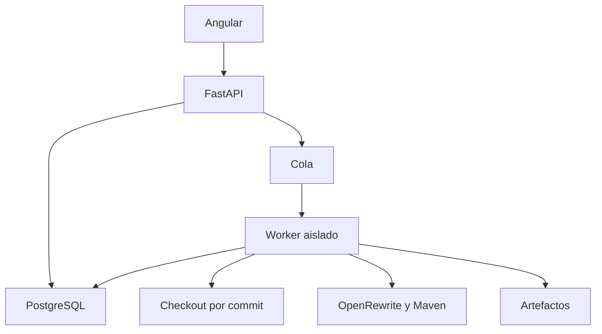

# Arquitectura propuesta
## Stack
| Capa | Elección inicial | Motivo |
|---|---|---|
| Interfaz | Angular con Signals y PrimeNG | Formularios, tablas y revisión de cartera |
| API | Python FastAPI + Pydantic | Reutilizar scanner y contratos tipados |
| Orquestador | Worker Python separado | Trabajos largos fuera del proceso HTTP |
| Datos | PostgreSQL | Estados, auditoría, hallazgos y versiones |
| Cola | Redis con RQ o Celery, elegir una | Cancelación, retries técnicos y capacidad |
| Artefactos | Almacenamiento compatible S3 o Blob | Logs, diffs, reportes y paquetes |
| Transformación | OpenRewrite en contenedor JDK/Maven | Java/Maven mediante recetas |
| Identidad | OIDC corporativo | SSO y autorización por proyecto |

Comenzar con API modular y worker, no seis microservicios. Separar despliegues por necesidades de ejecución, no por cada analizador.

## Módulos backend
identity, projects, profiles, scans, findings, plans, executions, recipes, artifacts, audit. Interfaces: RepositoryProvider, BuildRunner, RecipeRunner, ArtifactStore, RuleCatalog. Dependencias del dominio no importan FastAPI ni clientes de nube.

## Worker
Un espacio efímero por ejecución; checkout del SHA; usuario sin privilegios; timeout, cuota CPU/RAM/disco; salida de red limitada a repositorios de dependencias aprobados. Maven ejecuta plugins del repositorio y por tanto se trata como ejecución de código no confiable. Limitar subprocesos y capturar su grupo para cancelarlo completo.

## Consistencia
Transacción DB + outbox para publicar trabajos. Entrega al menos una vez: worker usa lease e idempotencia por run/fase. Artifacts se confirman solo después de subir y verificar hash. No declarar cancelado hasta confirmar parada del proceso.

## IA
Adapter opcional que recibe fragmentos redactados y genera propuestas. No tiene permisos de Git, despliegue ni secretos. Registrar proveedor, modelo, prompt y revisión. Nunca usar confianza inventada como evidencia de equivalencia.

## Estado
Implementado según esta arquitectura con RQ como cola; ver `docs/15_IMPLEMENTACION.md`. Artefactos en sistema de archivos local (S3/Blob pendiente).
